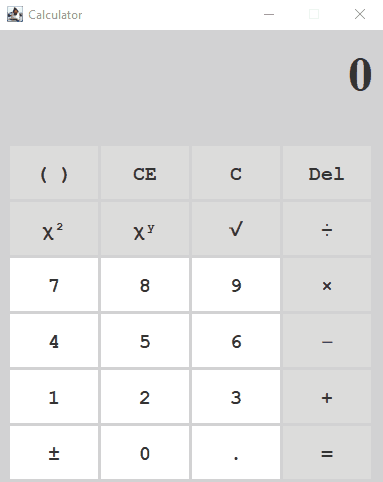

# Desktop Calculator
A Calculator Desktop App using written in Java Using Swing library.
The Calculator uses <a href="https://en.wikipedia.org/wiki/Reverse_Polish_notation">Postfix notation</a> to calculate a complex equation, including presidency and brackets, more in the examples bellow.

This application is GUI based and requires a window manager to be able to display the proper calculator.

# Requirement
- Java version 17+ <a href="https://www.oracle.com/de/java/technologies/downloads/">Java download Link</a>

# Build - Run Project
- Clone repository and navigate into repo's directory
- Run project with `$ ./gradlew run`

After running the application, use the calculator as you would usually do with any other calculator! encapsulate calculations in brackets to be able to calculate complex numbers.

# Examples
- 
- 
- 
